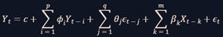

El modelo ARIMA (AutoRegressive Integrated Moving Average) es una herramienta estadística ampliamente utilizada en la predicción de series temporales. Su capacidad para modelar tendencias, estacionalidades y componentes de ruido lo hace idóneo para una variedad de aplicaciones, incluyendo la predicción de ventas, análisis financiero y control de calidad. En este informe, se describe el proceso de implementación del modelo ARIMA, la selección de hiperparámetros utilizando auto_arima, y la evaluación de los resultados obtenidos.

Fundamentos del Modelo ARIMA

ARIMA combina tres componentes principales:

AutoRegresivo (AR): Utiliza la relación entre una observación y un número de observaciones pasadas.

Integrado (I): Aplica diferenciación para convertir una serie no estacionaria en estacionaria.

Media Móvil (MA): Modela el error de predicción como una combinación lineal de errores previos.

Ecuación de Arima:

Para determinar el orden óptimo del modelo ARIMA (p, d, q), se emplean gráficos de autocorrelación (ACF) y autocorrelación parcial (PACF), además de criterios de información como AIC y BIC.

Preparación de los Datos

Antes de entrenar el modelo, se realizó un análisis exploratorio de los datos:

Se cargaron los datos y se estableció la columna date como índice para garantizar una correcta organización temporal.

Se identificó que los datos no estaban equiespaciados en el tiempo, ya que las entradas correspondían a fechas aleatorias, lo que generó una distribución irregular de observaciones en cada mes.

Se detectó la presencia de fechas duplicadas, lo que podría introducir sesgos en el modelo si no se maneja adecuadamente.

El hecho de que los datos no estén uniformemente espaciados en el tiempo afecta la aplicabilidad de ARIMA, dado que este modelo asume intervalos de tiempo constantes entre observaciones. Para mitigar este problema, se utilizó random forest para aumentar los datos.

Selección de Hiperparámetros con auto_arima

Para encontrar la mejor combinación de hiperparámetros (p, d, q), se utilizó la función auto_arima de la librería pmdarima. Esta herramienta realiza una búsqueda automatizada basada en criterios de información (AIC/BIC) y pruebas estadísticas para seleccionar el modelo más adecuado. Se consideraron los siguientes parámetros:

seasonal=False: Dado que no se observó una estacionalidad clara en los datos.

stepwise=True: Para acelerar la búsqueda utilizando heurísticas inteligentes.

maxiter=50: Para garantizar la convergencia del modelo.

out_of_sample_size=10: Para evaluar el desempeño fuera de muestra.

Evaluación del Modelo

Se evaluaron los modelos obtenidos utilizando múltiples métricas de error:

MAE (Mean Absolute Error): Media de los errores absolutos.

RMSE (Root Mean Squared Error): Raíz cuadrada del error cuadrático medio, útil para penalizar grandes desviaciones.

MAPE (Mean Absolute Percentage Error): Error absoluto medio relativo al valor real, expresado en porcentaje.

RRSE (Relative Root Squared Error): Proporciona una comparación con un modelo de referencia.

Para intentar mejorar los resultados obtenidos por ARIMA se aumentaron los datos de manera que aparecieran espaciados por la misma cantidad de tiempo (un día). Resultados de esta alternativa vs los datos originales:

También se provó usar el modelo ARIMA con los mismos datos originales (sin aumentar) pero acumulados por diferentes períodos de tiempo para intentar mejorar las predicciones. Resultados de esta alternativa:
