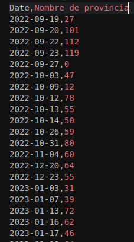
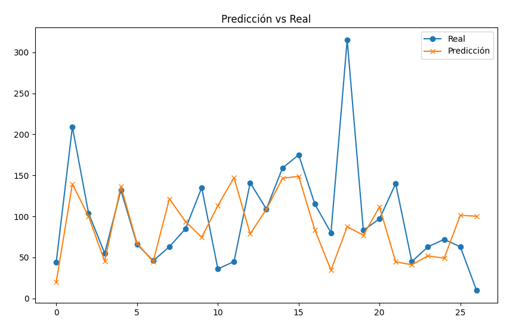

# RNN

Las Redes Neuronales Recurrentes están diseñadas para procesar datos secuenciales como series temporales, en nuestro caso aplicamos RNN para predecir la cantidad de ingresos por día de enfermos con Fiebre indeterminada o Sospecha de dengue en todos los hospitales de una provincia dada.

## Dataset

Ejemplo del dataset para una provincia:

Se entrenó el modelo con un total de 107 datos de días secuenciales y se testeo con 27 datos.

## Porqué RNN

La idea de utilizar RNN es identificar patrones en los ingresos, como picos relacionados con ciertas épocas del año, días de la semana u otros factores temporales. Una RNN con múltiples capas pudiera detectar relacionas a largo y corto plazo.

# Resultados

En la imagen se observan la cantidad de ingresos por días predecidos vs los reales, la principal dificultad se observa en la predicción de los picos de ingresos.

Durante el entrenamiento se probaron diferentes valores del hipérparámetro `n_steps` obteniendo valores muy similares en los resultados, finalmente se seleccionó un valor de 7. (7 días anteriores para predecir el siguiente)
Se obtuvo un Error Cuadrático Medio de 4009 y su raíz cuadrada es aproximadamente 63. Lo que
indica que el modelo tiene un error promedio de 63 ingresos por día. Dado que los valores de los datos están entre 0 y 300 el error es considerable.

# Dificultades

Dado que los intervalos no son regulares en el tiempo las relaciones temporales no son captadas adecuadamente por la RNN. Además el conjunto de datos es pequeño para entrenar correctamente el modelo.

# Conclusiones

Para mayor precisión en la predicción se intentará aumentar el tamaño del dataset y lograr una regularidad en los intervalos de tiempo.
